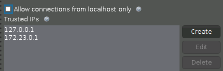

# Interactive Brokers Gateway Docker

IB Gateway running in Docker with [IBC](https://github.com/IbcAlpha/IBC) and VNC

* TWS Gateway: v981
* IBC: v3.10.0

### Getting Started

```bash
./build.sh
# after adding TWSUSERID and TWSPASSWORD
docker-compose up
```

#### Expected output

```bash
Creating ibgatewaydocker_tws_1 ...
Creating ib-gateway-docker_tws_1 ... done
Attaching to ib-gateway-docker_tws_1
tws_1  | Starting virtual X frame buffer: Xvfb.
tws_1  | stored passwd in file: /.vnc/passwd
tws_1  | Starting x11vnc.
tws_1  | +==============================================================================
tws_1  | +
tws_1  | + IBC version 3.10.0
tws_1  | +
tws_1  | + Running GATEWAY 981
tws_1  | +
tws_1  | + Diagnostic information is logged in:
tws_1  | +
tws_1  | + /opt/IBController/Logs/ibc-3.10.0_GATEWAY-981_Sunday.txt
tws_1  | +
tws_1  | +
tws_1  | Initialized
```

You will now have the IB Gateway app running on port 4001/4002 and VNC on 5900.

See [docker-compose.yml](docker-compose.yml) for configuring VNC password, accounts and trading mode.

Please do not open your box to the internet.

### Testing VNC

* localhost:5900


### Troubleshooting

⚠️ You may need to uncheck "Allow connections from localhost only" and add valid Trusted local IP address


```bash
# find container IP address
docker container inspect ib-gateway-docker_tws_1 | grep IPAddress
# find host ip address within the same subnet
ifconfig
# then add it to trusted ip address list
```


 ⚠️Sometimes, when running in non-daemon mode, you will see this:

```java
Exception in thread "main" java.awt.AWTError: Can't connect to X11 window server using ':0' as the value of the DISPLAY variable.
```

You will have to remove the container `docker-compose down` and run `docker-compose up` again.
